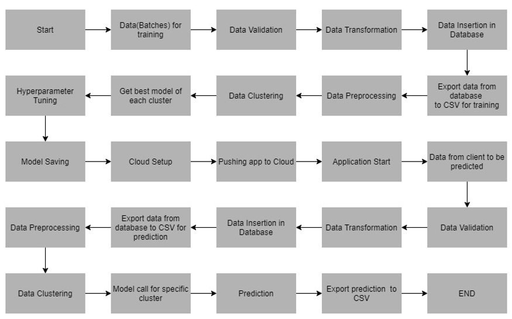

# Wafer-Fault-Detection

## Problem Statement:
**To build a classification methodology to predict the quality of wafer sensors based on the given training data.**
The inputs of various sensors for different wafers have been provided. In electronics, a wafer (also called a slice or substrate) is a thin slice of semiconductor used for the fabrication of integrated circuits. 
There are two classes: +1 and -1. 
*	+1 means that the wafer is in a working condition and it doesn’t need to be replaced.
*	-1 means that the wafer is faulty and it needs to be replaced. 

## Architecture

## Data Validation
In this step, we perform different sets of validation like filename validation, number of columns, name of the columns,data type of each columns and other kind of validations.

## Data Insertion in Database
In this step we perform the following things
1. Database Creation and connection
2. Table creation in the database
3. Insertion of files in the table
